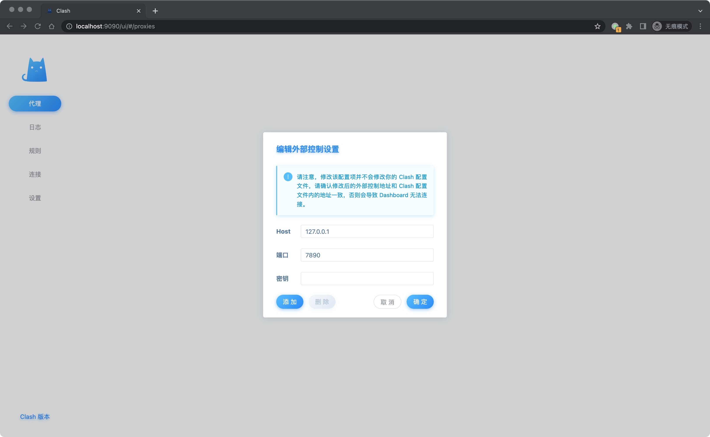
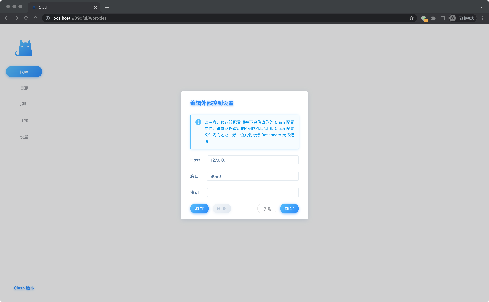
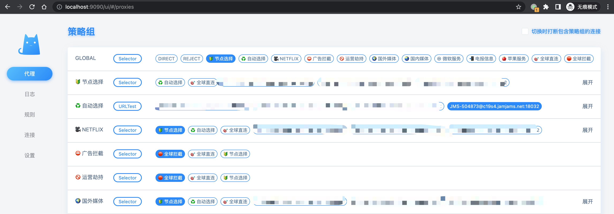
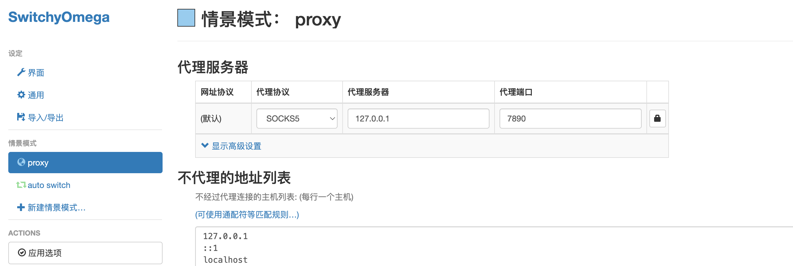

# self-compose
docker-compose use case for convenient

## clash 使用
1. 切换目录 `cd clash`
2. 把你的clash配置文件(config.yaml)放在config目录下
3. compose文件中只暴露了 7890(mixed-port) 和 9090(external-controller) 两个端口，如果需要拆开socks5代理和http代理可以手动暴露7890和7891端口
4. 执行 `docker-compose up -d` 启动代理服务
5. [可选]访问clash dashboard, 浏览器访问 `http://localhost:9090/ui`
   
   配置external-controller地址:
   
   点击添加之后就可以访问dashboard, 后续不在需要重复输入
   
6. 浏览器配置
   - 安装插件: SwitchyOmega
   - 配置本地socks5连接:
      